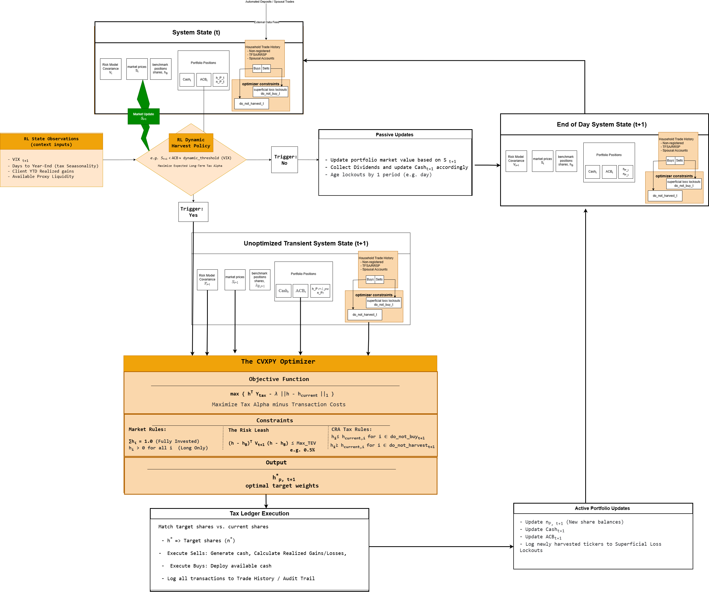

# Direct Indexing & Tax-Loss Harvesting (Canadian Framework)

## Overview
This repository contains a Python-based prototype for a Direct Indexing and Tax-Loss Harvesting (TLH) backtesting framework. It is designed to track a US equity benchmark (the S&P 500) while actively harvesting capital losses to generate tax alpha. 

Crucially, this engine bypasses standard US-centric TLH algorithms (like HIFO lot-picking) and is engineered specifically to model **Canada Revenue Agency (CRA)** tax frictions for non-registered accounts.

## Core Canadian Tax Mechanics Modeled
1. **Average Cost Base (ACB) Pooling:** Rather than picking specific tax lots to sell, the ledger mathematically pools the cost of identical properties upon every purchase, accurately reflecting Canadian tax reporting.
2. **Superficial Loss Rule (The 30-Day Rule):** The ledger enforces strict time-based lockouts. It dynamically generates pre-trade optimization constraints to prevent buying a stock 30 days *after* a harvested loss (Forward Rule), and blocks harvesting if the stock was purchased in the 30 days *prior* (Backward Rule).
3. **Dual-Ledger FX:** Assets are priced in USD, but the tax ledger calculates all ACB and capital gains in CAD using daily spot rates, correctly modeling the impact of currency fluctuations on tax liabilities.

## System Architecture
## System Architecture

  

The codebase is heavily modularized to separate data processing, accounting state, and portfolio optimization:

### Phase A: Data & Risk Infrastructure
*   **`a1_data_pipeline.py`**: Ingests point-in-time CRSP daily data, applies split adjustments, merges FRED USD/CAD daily spot rates, and standardizes the universe.
*   **`a2_factor_engine.py` & `a3_risk_estimator.py`**: Constructs a fundamental factor risk model using Fama-MacBeth regressions and EWMA, estimating the forward-looking Covariance Matrix ($V$) to manage tracking error.

### Phase B: The Tax Ledger & State Machine
*   **`b1_risk_model.py`**: Dynamically reconstructs the $V$ matrix for the active daily roster.
*   **`b2_tax_ledger.py`**: An $O(1)$ event-driven accounting ledger. It tracks cash balances, updates the pooled ACB, registers realized PnL, and passes lockout restrictions to the optimizer.

### Phase C: Convex Optimization
*   **`c1_heuristic_optimizer.py`**: A V1 baseline optimizer that strictly minimizes Tracking Error Variance (TEV) while forcing liquidations of losing assets.
*   **`c2_tax_alpha_optimizer.py`**: A V2 convex optimizer (using CVXPY). It reframes the objective to maximize the opportunity cost of unrealized losses minus an $L_1$ turnover penalty, subject to a strict $L_2$ Tracking Error budget. This formulation naturally discovers **"Partial Harvesting"**—scaling sell orders organically to balance tax yield against risk limits.
*   **`c3_backtest_runner.py`**: The main orchestrator that steps through time, triggers the harvest scanner, and translates continuous optimal weights into discrete fractional shares (truncated to 4 decimal places to prevent cash overdrafts).

## Mathematical Formulation (V2 Optimizer)
The core portfolio construction relies on quadratic programming to balance tracking error against transaction friction:

$$ \min \left( h^T \cdot C_{tax} + \lambda || h - h_{\text{current}} ||_1 \right) $$

**Subject to:**
*   $(h - h_b)^T V (h - h_b) \le \text{Max TEV}$ *(Relative Risk Budgeting)*
*   $\sum h = 1.0, \quad h \ge 0$ *(Fully Invested, Long Only)*
*   $h_i \le h_{\text{current}, i}$ for $i \in \text{Forward Lockouts}$
*   $h_i \ge h_{\text{current}, i}$ for $i \in \text{Backward Lockouts}$

*(Where $C_{tax}$ represents the harvest opportunity cost vector, driving the weights of losing stocks toward zero).*

## Quick Start
The project logic and stress-testing can be viewed in the included Jupyter Notebooks:
1. **`presentation.ipynb`**: A functional walk-through of the accounting logic, highlighting the transition from procedural loops to the final Object-Oriented architecture, including a hyperparameter grid search.
2. **`main.ipynb`**: Executes the final OOP pipeline over the 2019-2020 sub-period, demonstrating the algorithm's ability to autonomously harvest losses and maintain benchmark tracking during the March 2020 market crash.

---
*Disclaimer: This repository is a prototype built for quantitative research and architectural demonstration purposes. It does not constitute financial or tax advice.*